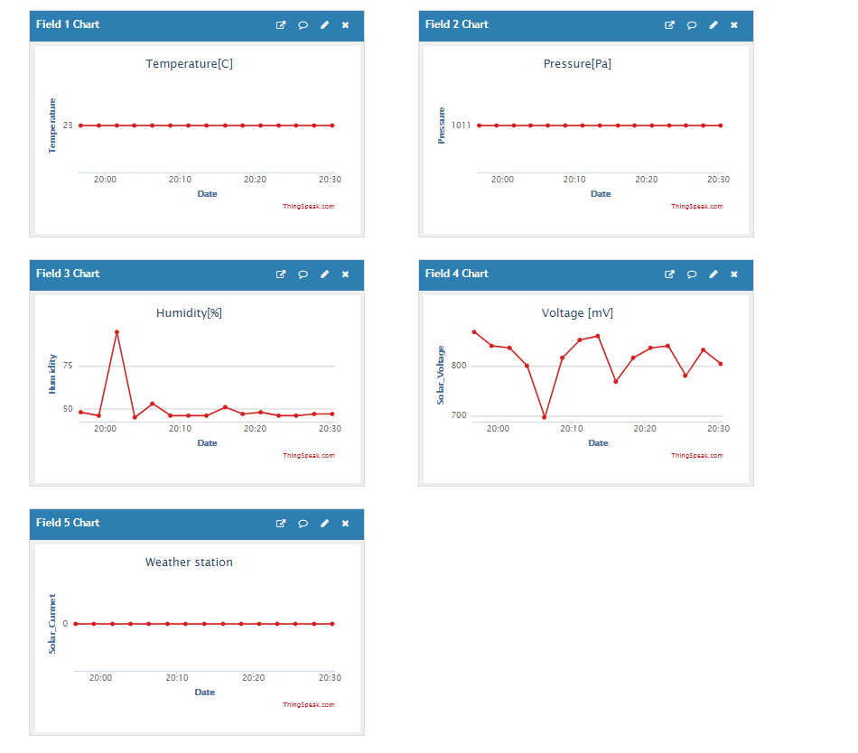

# Solar powered weather station
In followed project I wanted to create simple weather station with WiFi connectivity that is capable of sending data to external server, such as ThingSpeak.
Over time I decided to source this station with Li-Po battery and charge it through 1W solar panel, hoping that it will last a little bit longer without external battery charging.
Station sends data within 2 minutes period in order to minimize power consumption. The data that is being send to ThingSpeak consists of 5 data types such as:
- temperature
- humidity
- pressure
- solar current
- solar voltage

## Things that I used in this project:
1. STM32 NUCLEO L031K6
2. DHT11 Humidity sensor
3. BMP280 Temperature/Pressure sensor
4. INA219 - Current sensor
5. ESP01 - WiFi module
6. 18650 Li-Po battery
7. Solar panel 1W 6V
8. Solar panel regulator

## Things to do before using this code
1.  Enter your API key that comes from ThingSpeak into API_Key variable in the beggining of the code
2.  In function ESP8266_Init specify your router name and password
